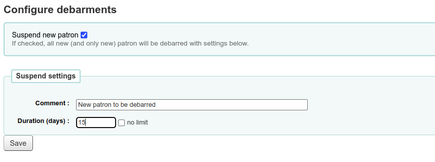

# Debarments

Debarments allow to supsend all new patrons imported by the patron-import plugin.

To suspend the new patrons, check the "Suspend new patron" option in debarments configuration page.
Set a comment which will be shown in the debarredcomment column of borrowers table.
And finally, set a duration (in days) unitl the patron will be debarred. 
You can check "no limit" option so that the patron will be suspend until a librarian remove the debarment.

