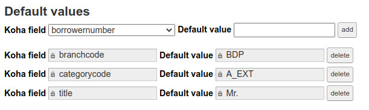

# Default values

Default values allow to prevent a field being left blank and so to force it to have a value (the default one) in Koha. Not to be confused with the fallback "If none of this rules match" under the value mappings table which could apply even if the field contains a value. Default value are set only if the field is empty or non-existing.

To add a default value for a field, in the correponding page, select a (Koha) field, type the wanted default value and click on "Add" button.

> Default values are not allowed for exetended attributes.

**Important**: note that there is a specific behavior with the **categorycode** and **branchcode** fields regarding the default values: In the import process, these fields are blanked out if the value does not match a valid category or branch in Koha. So if your set default values for these fields, we can consider that they could be applied even if they are not empty. 
