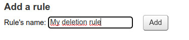
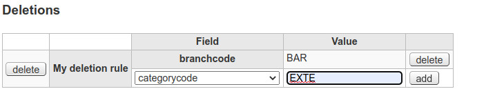

# Deletions

Deletion rules are a set of fields/values defining which borrowers must be delted in Koha.

2 conditions must be met to delete a borrower:
1) the entire rule fields must have been matched the incoming data
2) the incoming data must have been matched a corresponding patron in Koha regarding the [matching point](matching-point.md)
3) the matched Koha borrower must not have any due charges
4) the matched Koha borrower must not have any due checkouts

### Create a rule

Type a rule name and click "Add" button.

### Add fields

Select a field, entrer a value and click on "Add" button.

