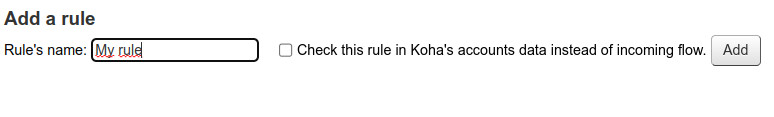

# Exclusions

Exclusion rules allow to define some incoming borrowers to be ignored (skipped). A rule is a set of koha field => value. All fields of the rule must match to skip the borrower.

There is two rule types:
* **External**: match the incoming data
* **Koha**: match the Koha data (if a correponding borrower was found).

### Create a rule

Type a rule name, check if you want a Koha rule or not and click "Add" button.

### Add fields

Select a field, entrer a value and click on "Add" button.

