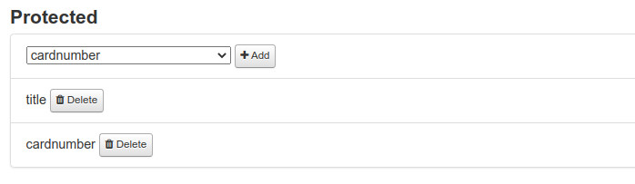
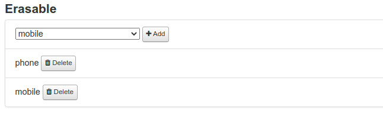

# Protected and erasable fields

This page is accessible by clicking on "Protected/erasables" of your import in the index configuration page.

### Protected fields

Protecting fields allows to prevent it to be modified with a new value when updating a patron. Protecting feature affect only the update and id useless for the creation.

> Note that only a non blank value can erase a field when updating. 

### Erasable fields

Erasure is the opposite of protecting. If want you want to force a blank incoming field to update the Koha field, so set the field as erasable.

