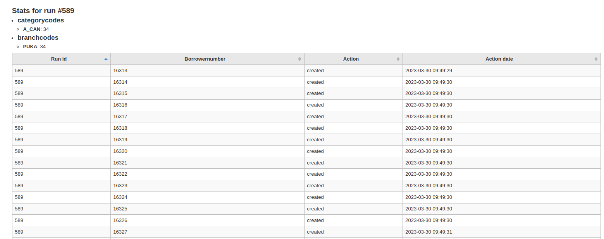

# Runs

On each run detail, you can see which borrowers have passed through the plugin, with information about the actions performed (creation, update or deletion for example) and the date of that action.

