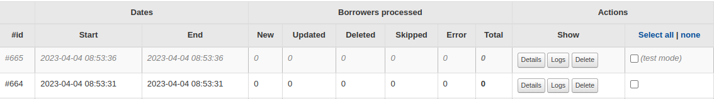

# Runs

Runs record various information (depending on the options passed to the script), and to separate runs started with the `--dry-run` option, there is a specific class to distinguish them.

On each run detail, you can see which borrowers have passed through the plugin, with information about the actions performed (creation, update or deletion for example) and the date of that action.

