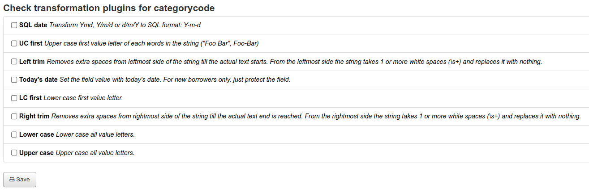

# Transformation plugins

Tranformation plugins are a set of data filter available to apply frequent changes on incoming data. They are applied just after the field mappings process and before the value mappings. The mappings order is:
1. Field mapping (source field => target field)
2. **Transformation plugins**
3. Value mapping
4. Default value

You can choose none, one or more transformation plugins. To apply tranformation plugins, click on "Transformation plugins" button in the corresponding mapping on [field mappings page](field-mappings.md). In the transformation plugins page select the ones you want to use.

