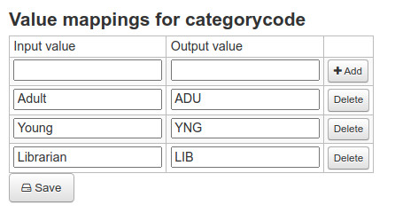

# Value mappings

Value mappings allow you to transform source field values into others values during the mapping process.
Value mappings are configured for each fied mapping.

### Add new value mapping

In the [field mappings](field-mappings.md) page, click on "Value mappings" button of the corresponding field mapping.
In the table, add as any value mappings as you want and save.

The left value (Input value) is the incoming value from your source field. The right value (Output value) is the replacement value.

A good example for value mappings is the transformation of category codes to make they match valid koha's categorycodes.

In the example above, for the field mapping in destination to categorycode, "Adult" will tranformed to "ADU", "Young" to "YNG" and "Librarian" to "LIB"

### If none of this rules match

Under the value mappings table you can set a "fallback" value. This value will be set only if none of the existing rules have matched the field. Not to be confused with the [default-values](default-values.md) which are applied if the field id empty or non-existent.

