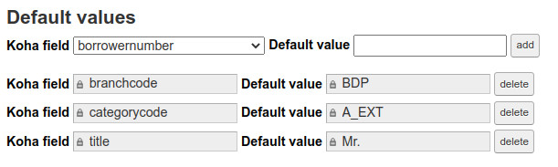

.. _default_values:

Default values
==============

Default values prevent a field from being left empty and therefore force it to have a value (the default value) in Koha.

Not to be confused with the “If none of these rules match” fallback in the value match table, which may apply even if the field contains a value.
Which may apply even if the field contains a value. 
Default values are only defined if the field is empty or non-existent.

To add a default value to a field, in the corresponding page, select a
(Koha) field, enter the desired default value and click on the `"Add"` button.

.. warning::

   Default values are not allowed for extended attributes.

   Default values

.. important:: 
    Note that the **categorycode** and **branchcode** fields have specific behavior with regard to default values.
    During the import process, these fields are deleted if the value does not correspond to a valid category or branch in Koha.
    So if your set default values for these fields, we can assume that they can be applied even if they are not empty.