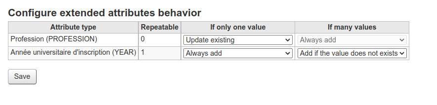

.. _extented_attributes:

Extended attributes
===================

This page is used to configure the behavior of each extended attribute of an existing patron when updating Koha patron.

For each attribute, the behavior can be configured for differents situations:

.. note::
  If attribute is not repeatable, `"If many values"` select will be disabled.

**Attribute is already defined with a value (only one)**
  - `Do nothing`: Nothing is added or updated
  - `Update existing`: erase the existing value

**Attribute is already defined with more than one value (many)**
  - `Do nothing`: Nothing is added or updated
  - `Update existing`: erase the existing value
  - `Add if the values does not exists`: add new value from incoming data if it does not exists

   Extended attributes

.. important:: 
  When `"Update existing"` is selected, check that the incoming data matches the data you wish to replace, even if there are empty data or strings on the attribute.
